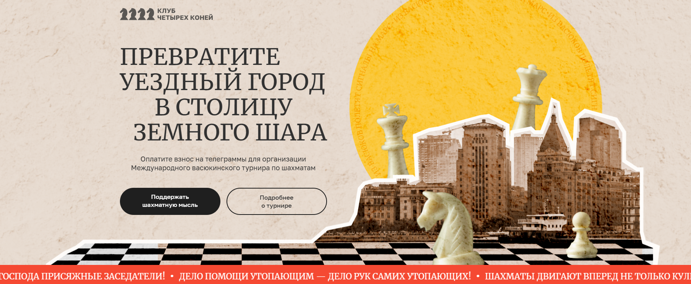

# Клуб четырёх коней — Лендинг

Адаптивный промо-сайт, разработанный по макету для демонстрации ключевых мероприятий и участников «Международного васюкинского турнира».  
Проект реализован с акцентом на чистую семантическую вёрстку, оптимизацию загрузки и доступность.



## ✨ Основные особенности

- **Чистая вёрстка** по методологии [БЭМ](https://en.bem.info/methodology/)  
- **Адаптивный дизайн** для брейкпоинтов 1440px, 1024px, 768px, 480px, 320px
- **Оптимизация изображений**:
  - Использование `WebP`
  - Ленивая загрузка `loading="lazy"` для медиа ниже первого экрана
- **Доступность (a11y)**:
  - Навигация с клавиатуры (`:focus-visible`)
  - ARIA-атрибуты для управляющих элементов
  - Корректные `alt` для всех изображений
- **Микроинтеракции** и плавные анимации с поддержкой `prefers-reduced-motion`
- **Слайдеры** с кастомным управлением

## 🛠 Стек технологий

- **HTML5** — семантическая разметка
- **SCSS** → **CSS3** — модульная структура стилей, минификация
- **JavaScript (ES6)** — интерактивные элементы, слайдеры, навигация
- **BEM-Naming** — единообразная структура классов
- **Git** — контроль версий

## 📂 Структура проекта
prod/
├── css/
│ ├── style.css
│ └── style.min.css
├── img/
│ ├── promo/
│ ├── presentation/
│ ├── participants/
│ └── stages/
├── js/
│ ├── app.js
│ └── app.min.js
├── index.html
└── README.md


## 🚀 Запуск проекта локально

1. Клонировать репозиторий:
   ```bash
   git clone https://github.com/sszaickin2/Yandex-test-task.git
   cd Yandex-test-task


   


